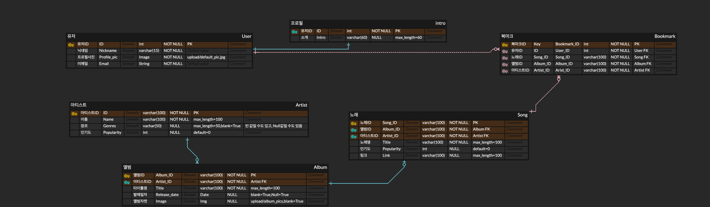
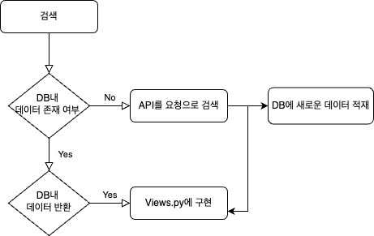
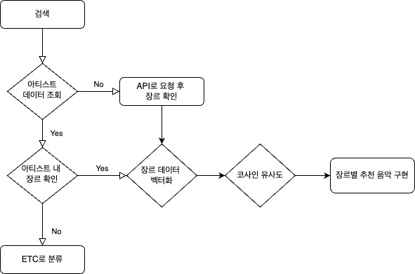

# (산대특)_파이썬 오픈소스를 활용한 머신러닝 빅데이터 분석 SW개발자 양성_육성 2기 

## 주제명 : Sixfortypy
### 조원 : 강귀권 / 최련정 / 박준영(부팀장) / 황의철(팀장)
------

* 사용언어 : Python3.8.5 / HTML / CSS / JavaScript / 
* 개발도구 : Jupyter Notebook,VScode
* 서버환경 : Nginx
* 데이터베이스 : MySQL
* 컨테이너 / 클라우드 : Docker,Docker-compose, AWS Lightsail
* 디자인도구 : Adobe Photoshop 

---
## 시스템 아키텍처 

-----
## ERD 

ERD_CLOUD : https://www.erdcloud.com/d/Y6QKTjKWbS3FwfZXs
-----
## Event-Flow 
* 검색로직 

* 추천시스템 로직 

---
## 페이지시연 
* 음악검색 

* 회원별 맞춤 음악 추천 시스템

---